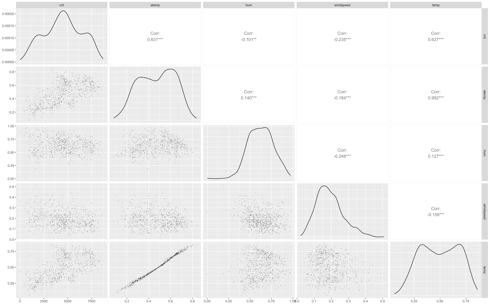

```{r setup, include=FALSE}
knitr::opts_chunk$set(echo = TRUE)
```

# Introduction

We want to explore how weather conditions (such as weather classification, temperature, humidity, and windspeed), seasons, days of the week, and months of the year affect the number of bikes that are rented on a given day. By doing linear regression, we can see each variable will individually affect the count and how variables will affect the count when multiple are taken into account. 

# Data
We use the bike rentals dataset. 
This is a data set that records the cnt (number of bikes that are rented) as well atemp (normalized temperature), hum (humidity), windspeed, season (season1, 2, 3, 4 representing Winter, Spring, Summer, Fall, respectively), year (year 0 as 2011 and year 1 as 2012), month (indexed 1-12 beginning at January), weekday (indexed 0-6 starting at Sunday), holiday (0 representing not a holiday and 1 representing a holiday), weathersit (1, 2, 3 representing clear days, less clear and light rain, and cold, rainy, and snowy), casual (representing first time users), and registered (representing repeat users). 

We first checked the correlation between the variables:



We see extreme correlation between atemp and temp, which is reasonable since they different scaled variables from the same source. We used atemp rather than temp. We don't use casual or registered because these variables are added to obtain count (cnt). We know that atemp and humidity are correlated same as seasons and months in real life but in this project our main purpose is to build a multiple linear model, later in our lab report we will consider model selection, so we continue to use both.

# Statistical Modeling Framework

Our dependent variable is cnt. Our independent variables: atemp, hum, windspeed, season, year, month, weekday, holiday, and weathersit. 

From our previous labs we saw that the temperature alone was explaining about 30-40% of the model’s variability, so we wanted to look at adding additional variables to temperature

Before moving on, we aimed to explore the differences between weekdays and weekends. As noted earlier, the dynamics of bike rentals appear to differ between weekdays and weekends. Specifically, the distribution of the number of bikes rented shows distinct patterns depending on the day type. (A plot illustrating these differences is included in the Appendix.) 


We created four models with the same independent variables with slight modications: 

1. **Model looking only at weekends (subset of the data)**
2. **Model looking only at weekdays (subset of the data)**
3. **Model looking at weekend vs weekday (entire data but day type classified into weekdays and weekends)**
4. **Model with no modifitions (data in its natural state)**

In all cases, there is a positive trend in bike rentals from 2011 to 2012. More people rented bikes in 2012 in every model compared to 2011, the baseline. 

In all cases, seasonFall shows the largest and most significant positive change compared to seasonWinter, which serves as the reference category. The positive and significant estimate indicates that bike rentals are higher in fall relative to winter.

Additionally, in every case, weathersit1 (or clear, sunny days) is the reference, and we see a significant decline in bike rentals as we transition to moving to the other weathersits, with weathersit3 (cloudy) showing a much more extreme negative jump, which we attribute to people not riding bikes in cold, rainy, snowy days. 

Windspeed and humidity both have negative trends, but vary in significance among models, while temperature is significantly positive across all models. 

For months, January is set as the reference. February to October have a positive difference while there is a negative difference between January and November and December. This is consistent with our other hypotheses that people do not want to ride bikes in the winter or on averagely colder, worse-weather days.

# Questions

For every question, we assume independence of the explanatory variables, residuals are normally distributed and uncorrelated. 


-   *How do bike rentals differ within weekends?*

Linear regression model describing how the cnt (number of bike rentals) is affected by all the aforementioned variables, excluding weekdays (weekdays 1-5) and using weekday0 (Sunday) as a reference.

When using Sunday as a reference, there is a significant change in bike rentals. By comparing Sunday to Saturday, there is a significant difference between the two. Rentals jumps up significantly when we move from Sunday to Saturday. 

Windspeed and humidity both have a negative trend, but humidity is not significantly contributing to the model. There is a significant correlation between humidity and atemp which may account for the fact that in the presence of atemp, the humidity is not significant. This could also be due the fact that the sample size used here is small. Table 1 summarizes the output of our model.

```{r echo=FALSE, results='asis'}
library(knitr)

reg_results <- data.frame(
  Coefficient = c("(Intercept)", "seasonString", "seasonSummer", "seasonFall", "year 1", 
                  "Febuary", "March", "April", "May", "June", "July", "August", 
                  "September", "October", "November", "December", "Saturday", 
                  "Few Cloudy", "Partly Cloudy", "Atemp", "Humidity", "Windspeed"),
  Estimate = c(986.2, 672.0, 556.0, 1838.1, 1943.2, 338.1, 986.4, 1193.2, 
               1453.4, 1286.5, 504.5, 711.2, 1626.9, 593.0, -305.7, -532.9, 
               469.4, -529.3, -2132.6, 4890.3, -1013.6, -3259.1),
  Std_Error = c(490.6, 395.0, 447.8, 371.3, 122.6, 295.8, 338.2, 528.9, 
                572.3, 593.3, 658.7, 630.3, 551.2, 498.2, 480.5, 364.4, 
                120.0, 182.6, 500.4, 993.4, 639.1, 903.0),
  t_value = c(2.010, 1.701, 1.242, 4.951, 15.851, 1.143, 2.917, 2.256, 
              2.539, 2.168, 0.766, 1.128, 2.951, 1.190, -0.636, -1.462, 
              3.911, -2.899, -4.262, 4.923, -1.586, -3.609),
  Pr = c(0.045863, 0.090560, 0.215917, 1.64e-06, 2e-16, 0.254545, 0.003971,
         0.025214, 0.011916, 0.031389, 0.444686, 0.260620, 0.003566, 
         0.235435, 0.525411, 0.145314, 0.000128, 0.004187, 3.20e-05, 
         1.86e-06, 0.114429, 0.000394)
)
# Add significance stars
reg_results$Significance <- cut(
  reg_results$Pr,
  breaks = c(-Inf, 0.001, 0.01, 0.05, 0.1, Inf),
  labels = c("***", "**", "*", ".", "")
)

kable(reg_results, caption = "Regression Coefficients Table for Weekends", digits = 4)
```
-   *How do bike rentals differ within weekdays?*

Linear regression model describing how the cnt (number of bike rentals) is affected by all the aforementioned variables, excluding weekends (weekdays 0 and 6) and using weekday1 (Monday) as our reference.

At 5% significant level, there is no significant difference in bike rentals when we compare the other weekdays to Monday. Even though there is a difference in the bike rentals across the weekdays, the difference is not significant. Since all these days are work days, it makes sense that there is no day with a significantly different amount of bike rentals. 

Humidity, in this case, is significant and shows a negative trend. Summary of this model is seen in table 2.

```{r echo=FALSE, results='asis'}
library(knitr)

reg_results <- data.frame(
  Coefficient = c("(Intercept)", "Spring", "Summer", "Fall", "Year 1", 
                  "February", "March", "April", "May", "June", "July", "August", 
                  "September", "October", "November", "December", 
                  "Tuesday", "Wednesday", "Thursday", "Friday", 
                  "Holiday", "Few Clouds", "Partly Cloudy", 
                  "Atemp", "Humidity", "Windspeed"),
  Estimate = c(1705.63, 946.12, 968.06, 1429.39, 2069.16, 61.57, 396.28, 200.27, 
               589.25, 395.28, 50.25, 550.38, 910.87, 615.74, 19.77, 136.33, 
               104.37, 183.14, 178.43, 240.66, -600.63, -462.72, -1973.27, 
               4527.30, -1632.65, -2073.40),
  Std_Error = c(264.15, 195.06, 235.09, 202.81, 64.46, 160.39, 183.89, 272.33, 
                287.97, 301.11, 337.26, 322.61, 286.89, 268.40, 256.50, 205.27, 
                102.00, 102.28, 102.15, 102.04, 168.85, 82.34, 210.13, 467.80, 
                324.24, 451.49),
  t_value = c(6.457, 4.850, 4.118, 7.048, 32.099, 0.384, 2.155, 0.735, 2.046, 
              1.313, 0.149, 1.706, 3.175, 2.294, 0.077, 0.664, 1.023, 1.791, 
              1.747, 2.358, -3.557, -5.620, -9.391, 9.678, -5.035, -4.592),
  Pr = c(2.55e-10, 1.65e-06, 4.48e-05, 6.12e-12, 2e-16, 0.701225, 0.031640, 
         0.462452, 0.041260, 0.189874, 0.881618, 0.088626, 0.001592, 0.022202, 
         0.938595, 0.506909, 0.306707, 0.073960, 0.081302, 0.018738, 0.000411, 
         3.20e-08, 2e-16, 2e-16, 6.69e-07, 5.57e-06)
)

# Add significance stars
reg_results$Significance <- cut(
  reg_results$Pr,
  breaks = c(-Inf, 0.001, 0.01, 0.05, 0.1, Inf),
  labels = c("***", "**", "*", ".", "")
)

# Display as Markdown table
kable(reg_results, caption = "Regression Coefficients Summary for Week Days", digits = 4)
```

-   *How do bike rentals differ between a weekday vs a weekend?*

Linear regression model describing how the cnt (number of bike rentals) is affected by all the aforementioned variables, but classifying each day as either weekend or weekday and using weekday as a reference. 

By using weekday as reference, moving from weekday to weekend shows a decline in bike rentals. On weekdays there are more rentals which may be due to the fact that people use bikes more consistently for work than for leisure. 

We observed that humidity, and wind speed are all significantly negatively correlated with bike rentals.

```{r echo=FALSE, results='asis'}
library(knitr)

reg_results <- data.frame(
  Coefficient = c("(Intercept)", "Atemp", "Humidity", "Windspeed", 
                  "Spring", "Summer", "Fall", "Year 1", 
                  "February", "March", "April", "May", "June", "July", 
                  "August", "September", "October", "November", "December", 
                  "Weekend", "Holiday", "Few Clouds", "Partly Cloudy"),
  Estimate = c(1824.06, 4666.83, -1629.02, -2668.73, 
               879.18, 859.64, 1561.56, 2024.12, 
               143.43, 583.26, 499.70, 841.03, 658.60, 162.78, 
               598.42, 1120.40, 587.32, -72.23, -59.64, 
               -132.84, -653.24, -442.02, -1894.66),
  Std_Error = c(230.47, 436.09, 294.83, 411.25, 
                182.08, 216.07, 183.62, 58.94, 
                145.87, 166.95, 249.84, 266.47, 277.02, 309.43, 
                296.43, 263.29, 243.85, 233.92, 184.78, 
                64.68, 176.05, 77.93, 198.85),
  t_value = c(7.914, 10.702, -5.525, -6.489, 
              4.829, 3.979, 8.504, 34.341, 
              0.983, 3.494, 2.000, 3.156, 2.377, 0.526, 
              2.019, 4.255, 2.409, -0.309, -0.323, 
              -2.054, -3.710, -5.672, -9.528),
  Pr = c(9.59e-15, 2e-16, 4.62e-08, 1.62e-10, 
         1.69e-06, 7.65e-05, 2e-16, 2e-16, 
         0.325835, 0.000506, 0.045871, 0.001666, 0.017696, 0.599013, 
         0.043888, 2.37e-05, 0.016270, 0.757567, 0.746964, 
         0.040370, 0.000223, 2.06e-08, 2e-16)
)

# Add significance stars
reg_results$Significance <- cut(
  reg_results$Pr,
  breaks = c(-Inf, 0.001, 0.01, 0.05, 0.1, Inf),
  labels = c("***", "**", "*", ".", "")
)

# Create clean markdown table
kable(reg_results, 
      caption = "Regression Results Including Weekday vs. Weekend Classification", 
      digits = 4)
```

-   *How do bike rentals differ between every day?*

Linear regression model describing how the cnt (number of bike rentals) is affected by all the aforementioned variables.

Very consistent with past models for all variables (excluding days of the week), with humidity being significant in this case.

With Sunday as a reference, there is a positive difference in bike rentals on all days compared to Sunday. However, only the change from Sunday and Tuesday to Saturday is significant. We hypothesize that this is because most days off are on Mondays. 

Holidays show a negative trend and represent a decline in bike rentals as compared to days that are not holidays, which make sense as we have already noted higher differences on work days compared to none working days. 

```{r echo=FALSE, results='asis'}
library(knitr)

# Create labeled regression summary table
reg_results <- data.frame(
  Coefficient = c("(Intercept)", "Atemp", "Humidity", "Windspeed",
                  "Spring", "Summer", "Fall", "Year 1",
                  "February", "March", "April", "May", "June", "July",
                  "August", "September", "October", "November", "December",
                  "Monday", "Tuesday", "Wednesday", "Thursday", "Friday", "Saturday",
                  "Holiday", "Few Clouds", "Partly Cloudy"),
  Estimate = c(1419.97, 4639.41, -1516.84, -2647.09,
               876.41, 848.80, 1578.83, 2027.87,
               137.39, 577.61, 500.97, 839.63, 660.67, 177.75,
               607.53, 1112.07, 566.62, -104.09, -84.48,
               209.72, 315.13, 392.54, 394.14, 453.87, 444.32,
               -561.17, -467.10, -1955.77),
  Std_Error = c(238.10, 431.50, 292.96, 406.38,
                179.85, 213.46, 181.40, 58.21,
                144.07, 164.92, 246.92, 263.32, 273.92, 306.15,
                293.18, 260.39, 241.00, 231.21, 182.61,
                109.73, 107.34, 107.58, 107.70, 107.36, 106.79,
                180.23, 77.23, 197.44),
  t_value = c(5.964, 10.752, -5.178, -6.514,
              4.873, 3.976, 8.704, 34.834,
              0.954, 3.502, 2.029, 3.189, 2.412, 0.581,
              2.072, 4.271, 2.351, -0.450, -0.463,
              1.911, 2.936, 3.649, 3.660, 4.227, 4.161,
              -3.114, -6.048, -9.906),
  Pr = c(3.90e-09, 2e-16, 2.94e-07, 1.40e-10,
         1.36e-06, 7.72e-05, 2e-16, 2e-16,
         0.340576, 0.000490, 0.042844, 0.001493, 0.016124, 0.561682,
         0.038611, 2.22e-05, 0.018991, 0.652716, 0.643765,
         0.056395, 0.003435, 0.000283, 0.000272, 2.68e-05, 3.56e-05,
         0.001922, 2.38e-09, 2e-16)
)

# Add significance stars
reg_results$Significance <- cut(
  reg_results$Pr,
  breaks = c(-Inf, 0.001, 0.01, 0.05, 0.1, Inf),
  labels = c("***", "**", "*", ".", "")
)

# Create pretty markdown table
kable(reg_results, 
      caption = "Regression Coefficients Summary (Including Weekday Effects)", 
      digits = 3, 
      align = "lrrrrc")
```

# Data Analysis Results

**Our model approximates about 85% of the variability (Model 4).**
Residuals
| Minimum    | Q 1       | Median           | Q 3            |Maximum      |
|------------|-----------|------------------|----------------|-------------|
| -3967.2    | -347.7    |        69.3      |     449.1      |  2929.7     |


Multiple R-squared: 0.8475, Adjusted R-squared: 0.8416 
F-statistic: 144.7 on 27 and 703 DF, p-value: < 2.2e-16

The regression model appears appropriate for explaining variations in daily bike rentals. With an R-squared of 0.8475 and an adjusted R-squared of 0.8416, the model accounts for a large proportion of the variability in daily bike rentals based on the data. The highly significant F-statistic (144.7, p < 2.2e-16) indicates that the predictors collectively have a meaningful relationship with bike rentals. Key factors such as temperature, year, weather conditions, and weekdays/weekends show strong significance, while some months have some individual impact. The residuals are reasonably centered around zero as daily bike rentals are hugh in scale. Overall, the model provides a reliable fit for analyzing the determinants of bike rental counts.

The Residuals vs. Fitted plot can be seen in the images folder in the images folder accessed via the link in the appendix section, under the name res-vs-fit.png. The residuals are mostly centered around 0, suggesting no extreme bias. There's no obvious pattern to their spread, so any heteroscedasticity is not severe. There are a few points with large negative residuals, such as points 668, 669, and 692. Analyzing the Q-Q plot in the same images folder under the name qq-res.png demonstrates the outliers are gathered in the tails, specifically the left tail. The left tail deviates significantly from the diagonal line and the upper tail does as well, but not to the same extent, suggesting normality is a fair, but imperfect assumption.

Moving forward, we would like explore how we can enhance our model through model selection techniques.

# Contributions

* Raul-Fikrat Azizli: Formatted report snippets into 1 final report.
* Thomas Laz: Created the initial models and residual analysis.
* Harrison Ofori: Code, help formulate ideas and review the report.
* Clare Oudard: Wrote up report based on what group talked about when meeting
* Zeid Yunis: Helped formulate project concepts/ideas and submitted the final report on Blackboard.

# Team Roles

* Coordinator: Harrison Ofori
* Recorder/Writer: Clare Oudard
* Modeler: Thomas Laz
* Monitor/Checker: Zeid Yunis
* Coder: Raul-Fikrat Azizli


# Appendix

[GitHub for Code](https://github.com/rlaziz/casma575-project.git)

https://github.com/rlaziz/casma575-project.git
